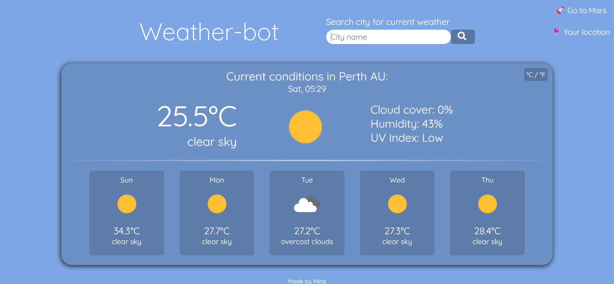
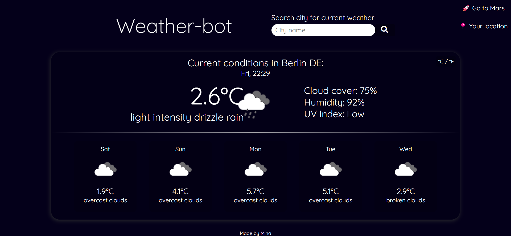
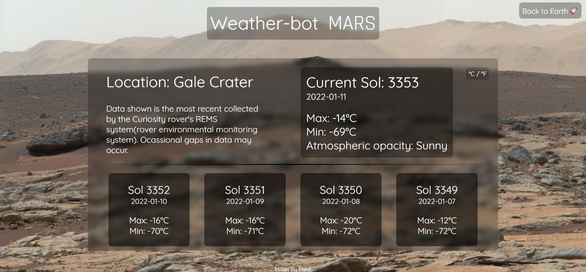

# Weather-bot
Weather-bot is a weather app built with vanilla JavaScript and using the OpenWeatherMap API. Weather data can be shown either by allowing your location or by directly searching city names. There is a celcius/fahrenheit converter, as well as a changing theme depending on time of day and current weather type.

Using a NASA curiosity API, I also added a page where you can see the latest weather data from Mars.

To use, clone repo and add your API key from <a href="https://openweathermap.org/api">OpenWeatherMap.org<a> (one call API, it's free) on line 13 of app.js.

